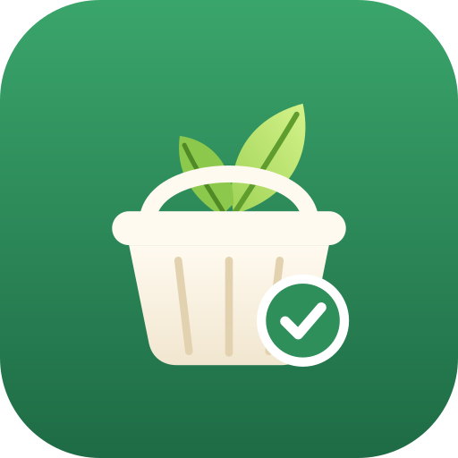

# WeeklyShopping

A shared shopping list and recipe book that installs on your phone like an app. It runs entirely on Cloudflare's free tier.

- **Shopping list**: autocomplete from past items and a catalog of about 450 Australian grocery products. Items are grouped by supermarket section automatically, and the list updates live on every phone.
- **Recipes**: about 1,400 vegetarian recipes from HelloFresh AU, EveryPlate AU and Mealime, each labelled with its source. "Add to list" first asks what you already have. Quantities can be shown in spoons/cups or converted to grams.
- **Seasoning blends**: 62 blends (including the r/hellofresh DIY master list) are recipes too, so you can buy the sachet or make it from scratch.
- **Ratings**: each person rates recipes, and the app records when you cooked them.
- **Login**: Google, through Cloudflare Access, limited to two accounts. The allowed emails are never stored in the repo.

See [PLAN.md](PLAN.md) for the design and [infra/terraform/README.md](infra/terraform/README.md) for deploying (Terraform + GitHub Actions).

## Stack

React 19, Vite, TanStack Router/Query, Tailwind v4 and shadcn-style components on the front end. tRPC v11 with SSE subscriptions for the API. Cloudflare Workers (Hono) and one Durable Object per household holding SQLite through Drizzle. Cloudflare Access with Google for login. Terraform for Access.

## Local development

```sh
pnpm install
cp .dev.vars.example .dev.vars   # enables the localhost-only dev login
pnpm dev                         # http://localhost:5173
```

`pnpm dev` runs the React app, the Worker and the Durable Object together in workerd. Data persists in `.wrangler/state`. There is no Google login locally: you're signed in as one of the `devMembers` in `config/household.json`, and **Settings → Dev: switch user** changes who you are. Open a second browser profile to watch live sync between two people.

| Command | What it does |
|---|---|
| `pnpm dev` | App + Worker + Durable Object with hot reload |
| `pnpm dev:reset` | Wipe the local database (content re-syncs automatically) |
| `pnpm preview` | Production build served by workerd |
| `pnpm typecheck` | TypeScript for client, worker and scripts |
| `pnpm test` | Unit tests (classification, units, ingredient parsing, blend expansion) |
| `pnpm test:e2e` | Playwright: two-browser live sync and the recipe → list flow |
| `pnpm content:check` | Validate catalog, recipes and blends |
| `pnpm db:generate` | Generate a Drizzle migration after editing `src/server/db/schema.ts` |
| `pnpm run deploy` | Build and deploy to Cloudflare |

## Adding recipes

Recipes live in the repo as JSON, not in the app:

```sh
pnpm recipe:import https://www.hellofresh.com.au/recipes/... --vegetarian   # HelloFresh, EveryPlate, Mealime, or any schema.org Recipe page
pnpm recipe:bulk everyplate                                              # whole vegetarian collections: hellofresh | everyplate | mealime
pnpm content:check
```

`--vegetarian` (always on for bulk imports) rejects any recipe whose ingredients include meat or seafood. The importer prints ingredients it couldn't match to the catalog and seasoning blends that don't have a recipe yet. Add products to `scripts/catalog-seed.ts` (then `pnpm catalog:build`), or add blends to `content/blends/`. Commit, then deploy. Content is bundled into the Worker and the Durable Object keeps it in memory, so new content writes nothing to the database; ratings, history and the list are kept.

## Layout

```
src/client    React app (routes, list + recipe features, UI components)
src/worker    Worker entry, Access JWT check, HouseholdDO
src/server    tRPC routers, list logic, content sync, Drizzle schema
src/shared    Code used on both sides: classification, units, blend expansion
content/      catalog.json, recipes/*.json, blends/*.json
config/       household members (who can sign in), Access settings
scripts/      recipe importer, catalog builder, content checks, icons
infra/        Terraform for Cloudflare Access + Google
```

## Staying inside the free tier

The Durable Object (and its SQLite database) has daily limits on the free plan: 100,000 requests and 100,000 rows written. The app is built to stay far below them:

- **Recipes never touch the database.** They're bundled with each deploy and held in memory by the Durable Object, which filters and pages them. There's no service worker or offline cache, so every phone always sees the current deploy.
- **Only household data is stored**: the list, item history, ratings, cooked log, week plan, ticked method steps and section order. Normal use is a few hundred writes a day.
- **Few API calls**: recipe lists load 40 cards at a time; the list, week plan and catalog update over the live stream instead of polling.
- **Failures degrade gracefully**: if writes are ever blocked, recipes still load and saving shows a clear message.

If you outgrow it, Workers Paid ($5/month) raises the limits to 50 million rows written per month.
